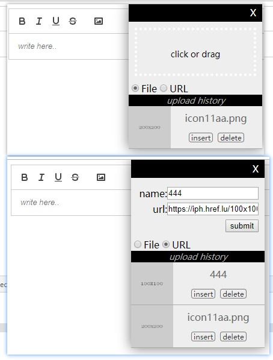

# react-quill-image-uploader

a plugin for react-quill which can upload multi image and remember the image url histroy



- click or drag an image into "click or drag" area, then plugin will call uploadCallback and wait for the promise
- plugin will remember the image url which is saved
- click the image preview, the plugin will insert the image(width=100%) into the editor
- drag the toolbar of the plugin and move where you want

# online demo

[demo](http://blog.pasico.cn/projects/react-quill-image-uploader/)

# how to install

```javascript
npm i react-quill-image-uploader
// yarn add react-quill-image-uploader
```

# how to use

```javascript
import ReactQuill from 'react-quill'
import 'react-quill/dist/quill.snow.css'
import ReactQuillImageUploader, {
  saveImageSrc,
} from 'react-quill-image-uploader'

class App extends React.Component {
  modules = {
    toolbar: {
      container: [['bold', 'italic', 'underline', 'strike'], ['image']],
      handlers: {
        image: () => {
          const { clientX, y: clientY } = window.event
          const position = { x: clientX, y: clientY } // position the plugin to show
          this.ReactQuillImageUploaderRef.toggle(position) // show or hide the plugin
          // toggle() is also ok
          // this.ReactQuillImageUploaderRef.toggle()
        },
      },
    },
  }
  componentDidMount() {
    this.quill = this.quillRef.getEditor()
    this.setState({ quill: this.quill })

    // add new one to history
    // from version 0.0.1
    // ReactQuillImageUploader.saveImageSrc("https://iph.href.lu/100x100")
    // from version 0.0.4
    ReactQuillImageUploader.saveImage({
      name: 'demo.jpg',
      src: 'https://iph.href.lu/100x100',
    })

    // remove all and add new one by the history api

    // es6
    // import {setHistory} from 'react-quill-image-uploader'
    // setHistory([{
    //   name: "demo.jpg",
    //   src: "https://iph.href.lu/100x100"
    // }])

    // es5
    // ReactQuillImageUploader.setHistory([{
    //   name: "demo.jpg",
    //   src: "https://iph.href.lu/100x100"
    // }])
  }

  uploadImageCallBack = (file, base64) => {
    // check file.size
    // check file type by file.name

    return new Promise((resolve, reject) => {
      // submit file to server
      let src = 'https://iph.href.lu/200x200' // demo image src
      if (base64) {
        src = base64
      }
      // upload img thing
      const uploadSuccess = false
      if (uploadSuccess) {
        // insert img into editor manually
        this.ReactQuillImageUploaderRef.insertImg(src)

        // return data to save to plugin history
        resolve({
          data: {
            name: file.name || '',
            link: src,
          },
        })
      } else if (!uploadSuccess) {
        // return resolve({status: 'fail'}) or reject(), plugin will warn the user to upload again, will not save in history
        // resolve({
        //   status: 'fail',
        // })
        // resolve()
        // or
        setTimeout(() => {
          return reject()
        }, 3 * 1000)
      } else {
        // return nothing, meaning that do not save anything to history or upload fail panel
        resolve()
      }
    })
  }
  render() {
    const { modules, className = '', placeholder = 'write here..' } = this.props
    const { quill = {} } = this.state
    return (
      <div>
        <ReactQuill
          ref={el => {
            this.quillRef = el
          }}
          placeholder={placeholder}
          modules={modules || this.modules}
          className={className}
        />
        <ReactQuillImageUploader
          ref={el => {
            this.ReactQuillImageUploaderRef = el
          }}
          isShowUploadFail={true} // default true, uopload fail history is hidden when false
          isShowHistory={true} // default true, history is hidden when false
          quill={this.state.quill}
          uploadCallback={uploadImageCallBack}
        />
      </div>
    )
  }
}
```

### api

- insertImg(imgSrc, width = "100%", source = "user") // insert img into editor at last editor selection index. [quill more info](https://quilljs.com/docs/api/#insertembed)
- saveImage({name,src}) // save name and src into localStorage
- saveImageSrc(src) // save src into localStorage
- (>=0.1.0) toggle({x=0,y=0,title=''}) // show or hide at browser somewhere, default is {title='', x = window.event.x, y = window.event.y}
- uploadCallback // return promise {data: {name,link}}
- (>=0.1.0) getHistory // return array [{name,src}]
- (>=0.1.0) setHistory // return boolean, return true if operation is success
- (>=0.1.0) removeHistory // return boolean, return true if operation is success

### history

- 20190719,v0.1.1
  - fix uploadCallback return nothing
  - uploadCallback support return `reject()` as well as `resolve({status: 'fail'})`
  - allow simultaneous uploads
  - show uploading files count when uploading
  - add history api args check for safe
  - add localstorage value check for safe
- 20190718,v0.1.0
  - fix editor selection bug (sorry guys)
  - support custom title for plugin by using api .toggle({title})
  - api .toggle() can be without any param now, default is {title='', x = window.event.x, y = window.event.y}
  - add upload failed status, add some history api [detail](https://github.com/pasicopan/react-quill-image-uploader/issues/1)
  - uploadCallback return nothing is ok now, which mean that I do not want to save anything to the history
  - this plugin can handle input other kind of file since (0.1.0) `uploadCallback can return nothing`, like audio and video
  - add isShowUploadFail flag to show or hide the upload fail panel
  - add isShowHistory flag to show or hide the upload history panel
- 20190612,v0.0.6 support to insert image by base64, modify image preview ui.
- 20190612,v0.0.5 fix bug for public method `saveImage`, add public method `insertImg` for inserting img by hand。
- 20190611,v0.0.4 add new upload type, upload by insert image src。
- 20190611,v0.0.3 update to new UI, insert image without focus on editor。
