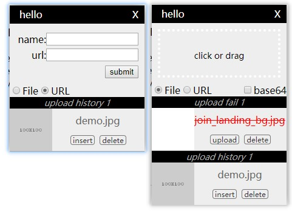

# react-quill-image-uploader
a plugin for react-quill which can upload multi image and remember the image url histroy



- click or drag an image into "click or drag" area, then plugin will call uploadCallback and wait for the promise
- plugin will remember the image url which is saved
- click the image preview, the plugin will insert the image(width=100%) into the editor
- drag the toolbar of the plugin and move where you want


# how to use
demo: ./demo/index.html [Demo](./demo/index.html "Demo")

```javascript
import ReactQuill from 'react-quill'
import ReactQuillImageUploader,{saveImageSrc} from 'ReactQuillImageUploader'

class App extends React.Component {
  modules = {
    toolbar: {
      handlers: {
        'image': () => {
          const {clientX,y:clientY } = window.event
          const position = {x:clientX,y:clientY}// position the plugin to show
          this.ReactQuillImageUploaderRef && this.ReactQuillImageUploaderRef.toggle(position) // show or hide the plugin
        }
      }
    }
  }
  componentDidMount () {
		this.quill = this.quillRef && this.quillRef.getEditor()
    this.setState({ quill: this.quill })
    // this.ReactQuillImageUploader.saveImageSrc('https://iph.href.lu/100x100') // save image url to plugin history manually
  }

  render () {
    const { modules, className = '', placeholder = 'write here..' } = this.props
    const { quill={} } = this.state
    return (<div>
      <ReactQuill
        ref={(el) => { this.quillRef = el; }}
        placeholder={placeholder}
        modules={modules || this.modules}
        className={className}/>
      <ReactQuillImageUploader ref={(el) => { this.ReactQuillImageUploaderRef = el }} quill={this.state.quill} uploadCallback={uploadImageCallBack} />
      {/* ES6 with webpack and import use <ReactQuillImageUploader /> */}
    </div>)
  }
}
async function uploadImageCallBack (file) {
  // post file
  return Promise.resolve({
    data: {
      link:'https://iph.href.lu/200x200'
    }
  })
}
```